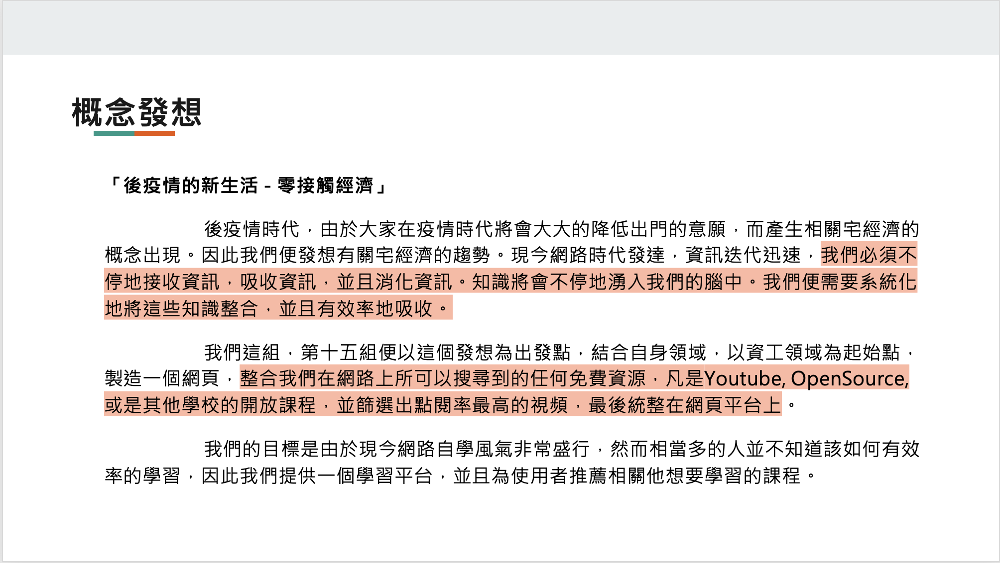

# DSC_ULearning #

## Contributors

* 林郁恩(emma159752@gmail.com)
* 謝承祐 (t4612310@gmail.com)
* 謝宗翰(t107590040@ntut.org.tw)
* 薛賀升 (t107590017@ntut.org.tw)

## 構思

## 想要解決什麼問題
* 系統化的自主學習服務
* 整合過多的學習資訊
* 資料分析/爬蟲 : Python / Spark

## 如何使用

1. 登入
2. 選擇專業
3. 顯示難度選擇、學習架構圖
4. 顯示影片清單選擇

## 未來規劃或使用場景

1. 更好的 model、爬蟲
2. AI 語意辨識 種類

## 使用到的技術

* 後端 : Express、FireBase、GCP
* 前端 : Vue.js
